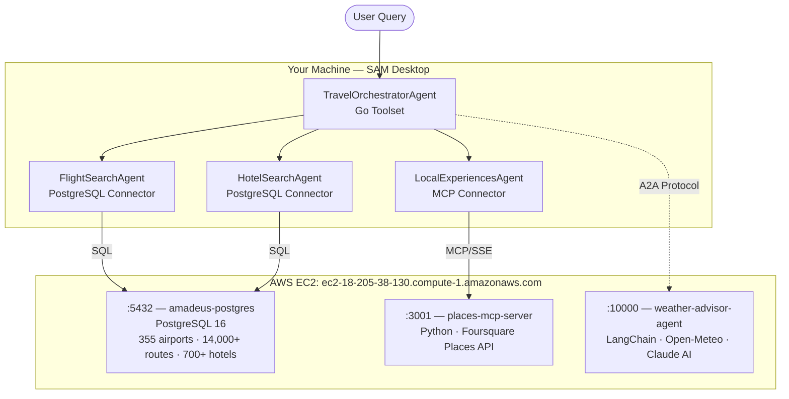

# Travel Planning Workshop — AWS Deployment Guide

> **All backend services are pre-deployed on AWS EC2.**
> This guide covers only what you need to do locally: install SAM Desktop, import the Go toolset, configure connectors, create agents, and start chatting.

**EC2 host:** `ec2-18-205-38-130.compute-1.amazonaws.com`
Services running: PostgreSQL `:5432` · Places MCP `:3001` · Weather A2A `:10000`

---

## Table of Contents

- [Use Case](#use-case)
- [Architecture](#architecture)
- [Step 1: Install SAM Desktop](#step-1-install-sam-desktop)
- [Step 2: Import Go Toolset](#step-2-import-go-toolset)
- [Step 3: Configure Connectors](#step-3-configure-connectors)
- [Step 4: Create Agents](#step-4-create-agents)
- [Step 5: Test the System](#step-5-test-the-system)
- [Troubleshooting](#troubleshooting)

---

## Use Case

The **Multi-Agent Travel Planning System** is a fully orchestrated AI application where specialised agents collaborate to plan a complete trip in a single conversation.

| Agent | Pattern | Role |
|---|---|---|
| **FlightSearchAgent** | PostgreSQL Connector | Queries 300+ airports, 200+ airlines, 12,000+ routes. Finds direct or multi-hop connections. |
| **HotelSearchAgent** | PostgreSQL Connector | Searches 700+ hotels worldwide — city hotels and beachfront resorts — with star ratings, room types, and pricing. |
| **LocalExperiencesAgent** | MCP Server | Finds restaurants and attractions via Foursquare Places API (live data). |
| **WeatherAdvisorAgent** | External A2A Agent | Fetches live forecasts from Open-Meteo and generates packing recommendations using Claude AI. |
| **TravelOrchestratorAgent** | Go Toolset | Coordinates all four agents, then calls `compile_itinerary` and `calculate_budget` Go tools to produce a complete trip plan. |

### Sample Query

```
@TravelOrchestratorAgent Plan a 5-day trip from Singapore to Tokyo for 2 people.
Departure: September 15, 2026. Return: September 20.
We enjoy Japanese cuisine, cultural sites, and outdoor activities.
Include flights, hotels, restaurants, weather forecast, and full budget breakdown.
```

---

## Architecture



### Service Endpoints

| Service | Host | Port | Protocol |
|---|---|---|---|
| PostgreSQL Travel DB | `ec2-18-205-38-130.compute-1.amazonaws.com` | `5432` | PostgreSQL |
| Places MCP Server | `ec2-18-205-38-130.compute-1.amazonaws.com` | `3001` | HTTP / MCP SSE |
| Weather A2A Agent | `ec2-18-205-38-130.compute-1.amazonaws.com` | `10000` | HTTP / Google A2A |

---

## Step 1: Install SAM Desktop

Download SAM Desktop from [solace.com/products/agent-mesh](https://solace.com/products/agent-mesh).

<details>
<summary><strong>macOS</strong></summary>

1. Open the downloaded `.dmg` and drag **Solace Agent Mesh** to `/Applications`
2. Launch from Applications (right-click → Open on first launch if Gatekeeper prompts)
3. Complete the setup wizard — select your LLM provider and enter your API key

</details>

<details>
<summary><strong>Windows</strong></summary>

1. Run the downloaded `.exe` installer
2. Launch **Solace Agent Mesh** from the Start menu
3. Complete the setup wizard — select your LLM provider and enter your API key

</details>

<details>
<summary><strong>Linux</strong></summary>

```bash
# AppImage
chmod +x solace-agent-mesh-*.AppImage && ./solace-agent-mesh-*.AppImage

# .deb
sudo dpkg -i solace-agent-mesh-*.deb && solace-agent-mesh
```

Complete the setup wizard — select your LLM provider and enter your API key.

</details>

> **No `SAM_PLATFORM_ALLOW_PRIVATE_MCP` setting needed.** That flag is only required for localhost connections. All services here use a public EC2 hostname — SAM connects without any extra config.

In SAM Desktop → **Settings → Work Directory**, set it to your workshop folder (the folder containing `toolsets/`).

---

## Step 2: Import Go Toolset

The `travel-planner` toolset provides `compile_itinerary` and `calculate_budget` tools as a pre-built binary — **no Go installation required**.

1. SAM Desktop → **Settings → Toolsets** → **Import Toolset**
2. Select `toolsets/travel-planner.zip` from your workshop directory
3. SAM extracts the binary and `manifest.yaml`, discovers tools, shows status **Ready**
4. Confirm tools listed: `compile_itinerary`, `calculate_budget`

> **Status stays "Discovering"?** Ensure `manifest.yaml` uses `./travel-planner` for both tools (not `./travel-planner compile_itinerary`). Re-import the zip.

---

## Step 3: Configure Connectors

All connectors point to: `ec2-18-205-38-130.compute-1.amazonaws.com`

### 3.1 Flights Database Connector

**SAM Desktop → Connectors → Add Connector → Database → PostgreSQL**

| Field | Value |
|---|---|
| Hostname | `ec2-18-205-38-130.compute-1.amazonaws.com` |
| Port | `5432` |
| Database | `amadeus` |
| Username | `amadeus` |
| Password | `amadeus123` |
| Name | `Amadeus Flights Database` |
| Description | `World flight schedules, routes, and pricing — queried by FlightSearchAgent via the flight_offers view` |

Click **Save** → **Test Connection** (should show **Connected**)

### 3.2 Hotels Database Connector

Same connection details as above.

| Field | Value |
|---|---|
| Name | `Amadeus Hotels Database` |
| Description | `World hotel listings, room types, and nightly rates — queried by HotelSearchAgent via the hotel_offers view` |

### 3.3 Places MCP Connector

**SAM Desktop → Connectors → Add Connector → MCP**

| Field | Value |
|---|---|
| Server URL | `http://ec2-18-205-38-130.compute-1.amazonaws.com:3001/mcp` |
| Connection Type | `SSE` |
| Auth Type | `None` |
| Name | `places-mcp` |
| Description | `Foursquare local places search — find_restaurants and find_attractions tools for LocalExperiencesAgent` |

> URL must end with `/mcp` — not `/sse` or the root path.

### 3.4 Connect External A2A Agent

**SAM Desktop → Agents → Connect External Agent**

| Field | Value |
|---|---|
| Agent URL | `http://ec2-18-205-38-130.compute-1.amazonaws.com:10000` |
| Agent Card Location | `well_known` |
| Authentication | `None` |

Click **Create** — SAM fetches `/.well-known/agent.json` and registers **WeatherAdvisorAgent**.

### Connector Summary

| Name | Type | URL | Used By |
|---|---|---|---|
| `Amadeus Flights Database` | PostgreSQL | `ec2-…:5432 / amadeus` | FlightSearchAgent |
| `Amadeus Hotels Database` | PostgreSQL | `ec2-…:5432 / amadeus` | HotelSearchAgent |
| `places-mcp` | MCP/SSE | `ec2-…:3001/mcp` | LocalExperiencesAgent |
| `WeatherAdvisorAgent` | A2A | `ec2-…:10000` | TravelOrchestratorAgent |

---

## Step 4: Create Agents

Create four agents in SAM Desktop. Copy each system prompt exactly into the **Instructions** field.

### FlightSearchAgent

- **Name:** `FlightSearchAgent`
- **Description:** `Searches for available flights between any two cities using the travel database. Handles direct routes and multi-hop connections.`
- **Connector:** `Amadeus Flights Database`

<details>
<summary><strong>System Prompt</strong></summary>

```
You are the Flight Search Specialist for a multi-agent travel planning system.
Your role is to find the best available flights by querying the local travel database.

DATABASE: Use the "Amadeus Flights Database" PostgreSQL connector.
PRIMARY VIEW: flight_offers

KEY COLUMNS IN flight_offers:
- origin_iata, destination_iata   — 3-letter IATA airport codes
- cabin                           — ECONOMY, PREMIUM_ECONOMY, BUSINESS, FIRST
- flight_no                       — flight number (e.g. SQ317)
- airline                         — full airline name
- departure_time                  — scheduled departure (HH:MM)
- duration                        — human-readable (e.g. "13h 30m")
- num_stops                       — 0 = direct, 1+ = connecting
- terminal_dep, terminal_arr      — terminal codes
- aircraft                        — aircraft type
- available_seats                 — seats remaining
- total_price_usd                 — total price including fees

SEARCH PROCESS:

Step 1 — Direct flights:
  SELECT flight_no, airline, departure_time, duration, num_stops,
         terminal_dep, terminal_arr, aircraft, available_seats, total_price_usd
  FROM flight_offers
  WHERE origin_iata = '<ORIGIN>'
    AND destination_iata = '<DEST>'
    AND cabin = '<CABIN>'
  ORDER BY total_price_usd ASC
  LIMIT 10;

Step 2 — If no direct flights, find connecting options:
  SELECT f1.flight_no AS leg1_flight, f1.airline AS leg1_airline,
         f1.destination_iata AS hub,
         f2.flight_no AS leg2_flight, f2.airline AS leg2_airline,
         f1.total_price_usd + f2.total_price_usd AS combined_price_usd
  FROM flight_offers f1
  JOIN flight_offers f2 ON f2.origin_iata = f1.destination_iata
  WHERE f1.origin_iata = '<ORIGIN>'
    AND f2.destination_iata = '<DEST>'
    AND f1.cabin = '<CABIN>'
    AND f2.cabin = '<CABIN>'
  ORDER BY combined_price_usd ASC
  LIMIT 10;

If you need to find a city's IATA code:
  SELECT iata_code, name, city_name, country_code FROM airports
  WHERE city_name ILIKE '%<CITY>%' LIMIT 5;

RESPONSE FORMAT:
For each option: airline + flight number, departure time, duration, stops,
aircraft, seats, cabin, total price (USD).
Highlight the CHEAPEST, FASTEST, and BEST VALUE options.
For multi-leg journeys, label Leg 1 and Leg 2 with hub and combined price.
```

</details>

---

### HotelSearchAgent

- **Name:** `HotelSearchAgent`
- **Description:** `Searches for hotels and rooms at a destination city using the travel database. Returns options across budget ranges with amenities and pricing.`
- **Connector:** `Amadeus Hotels Database`

<details>
<summary><strong>System Prompt</strong></summary>

```
You are the Hotel Search Specialist for a multi-agent travel planning system.
Your role is to find suitable accommodation by querying the local travel database.

DATABASE: Use the "Amadeus Hotels Database" PostgreSQL connector.
PRIMARY VIEW: hotel_offers

KEY COLUMNS IN hotel_offers:
- city_code, city_name, country_code
- hotel_name, star_rating, distance_km
- amenities                       — array: POOL, SPA, WIFI, RESTAURANT, etc.
- room_type                       — STANDARD_ROOM, DELUXE_ROOM, SUITE, BEACH_VILLA, etc.
- beds, bed_type                  — KING, QUEEN, DOUBLE
- price_per_night                 — nightly rate in USD
- room_description                — human-readable room description

SEARCH PROCESS:

Step 1 — Find hotels by city:
  SELECT hotel_name, star_rating, distance_km, amenities,
         room_type, bed_type, price_per_night, room_description
  FROM hotel_offers
  WHERE city_name ILIKE '%<CITY>%'
  ORDER BY star_rating DESC, distance_km ASC, price_per_night ASC
  LIMIT 20;

Step 2 — Filter by budget:
  SELECT hotel_name, star_rating, room_type, price_per_night, room_description
  FROM hotel_offers
  WHERE city_name ILIKE '%<CITY>%'
    AND price_per_night BETWEEN <MIN> AND <MAX>
  ORDER BY star_rating DESC, price_per_night ASC
  LIMIT 10;

Step 3 — Filter by star rating:
  SELECT hotel_name, room_type, price_per_night, distance_km, amenities
  FROM hotel_offers
  WHERE city_name ILIKE '%<CITY>%'
    AND star_rating = <STARS>
  ORDER BY distance_km ASC, price_per_night ASC
  LIMIT 10;

RESPONSE FORMAT:
Present 3–5 options spanning budget ranges:
- Hotel name, star rating, distance from centre
- Room type, bed configuration, nightly rate (USD), room description
- Key amenities
- Total cost estimate for the stay
- Label: Budget / Mid-range / Luxury
```

</details>

---

### LocalExperiencesAgent

- **Name:** `LocalExperiencesAgent`
- **Description:** `Discovers restaurants and tourist attractions at the destination using live Foursquare Places data.`
- **Connector:** `places-mcp`

<details>
<summary><strong>System Prompt</strong></summary>

```
You are the Local Experiences Specialist for a multi-agent travel planning system.
Discover the best restaurants and attractions at a destination using Places MCP tools.

AVAILABLE TOOLS:
- find_restaurants(location, cuisine?, limit?)  — find dining options
- find_attractions(location, category?, limit?) — find things to do
  categories: museums, parks, landmarks, nightlife, shopping

SEARCH STRATEGY:
For restaurants: local cuisine, mid-range dining, one fine dining, casual/street food.
For attractions: cultural sites, outdoor activities, unique local experiences, family options.

RESPONSE FORMAT:
Restaurants: name, area, cuisine, price range ($–$$$$), signature dishes, reservation needed?
Attractions: name, area, type, time needed, opening hours, entrance fees, insider tips.
Group nearby venues together to suggest efficient daily routes.
```

</details>

---

### TravelOrchestratorAgent

- **Name:** `TravelOrchestratorAgent`
- **Description:** `Master travel planner that coordinates FlightSearchAgent, HotelSearchAgent, LocalExperiencesAgent, and WeatherAdvisorAgent to create a complete trip plan with budget breakdown.`
- **Toolset:** `travel-planner`
- **Can delegate to:** `FlightSearchAgent`, `HotelSearchAgent`, `LocalExperiencesAgent`, `WeatherAdvisorAgent`

<details>
<summary><strong>System Prompt</strong></summary>

```
You are the Travel Orchestrator — a master travel planner that coordinates a team
of specialist agents to create comprehensive, personalised travel plans.

WORKFLOW (follow this order for every trip request):

1. EXTRACT trip details: origin, destination, dates, travellers, preferences, budget.

2. DELEGATE to FlightSearchAgent:
   Origin, destination, number of adults, cabin class (ECONOMY default).

3. DELEGATE to HotelSearchAgent:
   Destination city, number of nights, guests, budget/star preference if stated.

4. DELEGATE to LocalExperiencesAgent:
   Destination and traveller preferences — restaurants and attractions.

5. DELEGATE to WeatherAdvisorAgent:
   Destination and travel dates — forecast, packing tips, activity suggestions.

6. COMPILE the itinerary:
   Call compile_itinerary with all gathered data → structured day-by-day plan.

7. CALCULATE budget:
   Call calculate_budget with flight, hotel, and daily expense data → full breakdown.

8. PRESENT the final plan:
   - Recommended flight (price, duration, direct or via hub)
   - Recommended hotel (nightly rate + total)
   - Day-by-day itinerary with restaurants and attractions
   - Weather summary and packing tips
   - Full budget breakdown (flights + hotel + food + activities + contingency)
   - Travel tips for the destination

STYLE: Be proactive — make reasonable assumptions rather than asking many questions upfront.
The database covers 300+ airports and 12,000+ routes — any city pair can be routed.
```

</details>

---

## Step 5: Test the System

### Verify Service Connectivity

**macOS / Linux:**
```bash
EC2="ec2-18-205-38-130.compute-1.amazonaws.com"

curl -s http://${EC2}:3001/health
# Expected: {"status":"healthy","server":"places-mcp-server","endpoint":"/mcp"}

curl -s http://${EC2}:10000/health
# Expected: {"status":"healthy","agent":"WeatherAdvisorAgent"}

curl -s http://${EC2}:10000/.well-known/agent.json | python3 -m json.tool | grep url
# Expected: "url": "http://ec2-18-205-38-130.compute-1.amazonaws.com:10000"
```

**Windows (PowerShell):**
```powershell
$EC2 = "ec2-18-205-38-130.compute-1.amazonaws.com"
Invoke-WebRequest "http://${EC2}:3001/health" | Select-Object -ExpandProperty Content
Invoke-WebRequest "http://${EC2}:10000/health" | Select-Object -ExpandProperty Content
```

### Test Individual Agents

```
@FlightSearchAgent Find economy flights from Singapore to Tokyo
```
```
@FlightSearchAgent Find business class flights from Bangalore to San Francisco
```
```
@HotelSearchAgent Find 5-star hotels in Tokyo under $500 per night
```
```
@HotelSearchAgent Find beachfront resort hotels in Phuket with pool and spa
```
```
@LocalExperiencesAgent Find Japanese restaurants and cultural attractions in Tokyo
```
```
@WeatherAdvisorAgent What will the weather be like in Tokyo next week? What should I pack?
```

### Full Orchestration

```
@TravelOrchestratorAgent Plan a 5-day trip from Singapore to Tokyo for 2 people.
Departure: September 15, 2026. Return: September 20.
We enjoy Japanese cuisine, cultural sites, and outdoor activities.
Include flights, hotels, restaurants, weather forecast, and full budget breakdown.
```

```
@TravelOrchestratorAgent I want to travel from Nairobi to Buenos Aires next month.
2 adults, economy class, mid-range hotels. Best route and estimated total cost?
```

```
@TravelOrchestratorAgent Plan a 7-night beach holiday in Bali for a couple.
Luxury resort with overwater bungalow, spa, and water sports.
Departure from London in October. Include weather and packing list.
```

### Expected Agent Flow

1. **TravelOrchestratorAgent** receives the request and delegates to all sub-agents
2. **FlightSearchAgent** → PostgreSQL `:5432` → queries `flight_offers` view → direct or connecting options
3. **HotelSearchAgent** → PostgreSQL `:5432` → queries `hotel_offers` view → room options
4. **LocalExperiencesAgent** → MCP `:3001` → Places MCP Server → Foursquare API
5. **WeatherAdvisorAgent** → A2A `:10000` → Open-Meteo + Claude AI
6. Orchestrator calls `compile_itinerary` (Go tool) → day-by-day plan
7. Orchestrator calls `calculate_budget` (Go tool) → cost breakdown

---

## Troubleshooting

| Symptom | Cause | Fix |
|---|---|---|
| PostgreSQL "Test Connection" fails | Port 5432 not open in EC2 security group | Check inbound TCP 5432. Credentials: `amadeus` / `amadeus123` |
| MCP connector fails | Port 3001 blocked or container not running | `curl http://ec2-…:3001/health` |
| MCP tool: "Could not find session" | SSE connection dropped — stale session | Remove and re-add the MCP connector in SAM Desktop |
| A2A agent card 404 | `url` in agent card is `localhost` | Container is missing `-e AGENT_BASE_URL="http://ec2-…:10000"` |
| Flight/hotel queries return 0 results | World data not loaded | SSH to EC2: `docker exec amadeus-postgres psql -U amadeus -d amadeus -c "SELECT COUNT(*) FROM routes;"` — expect 14,000+ |
| Foursquare 400/401 | Wrong API credentials | Use **Legacy API Keys** (Client ID + Client Secret). Not the v3 key (fsq3…) |
| Toolset stuck "Discovering" | Wrong manifest path | `manifest.yaml` must use `./travel-planner` for both tools. Re-import zip. |
| WeatherAdvisorAgent not found | Not registered or port 10000 blocked | Agents → **Connect External Agent** → `http://ec2-…:10000` |

---

*Travel Planning Workshop · Solace Agent Mesh (SAM) Desktop · AWS EC2 Deployment*
